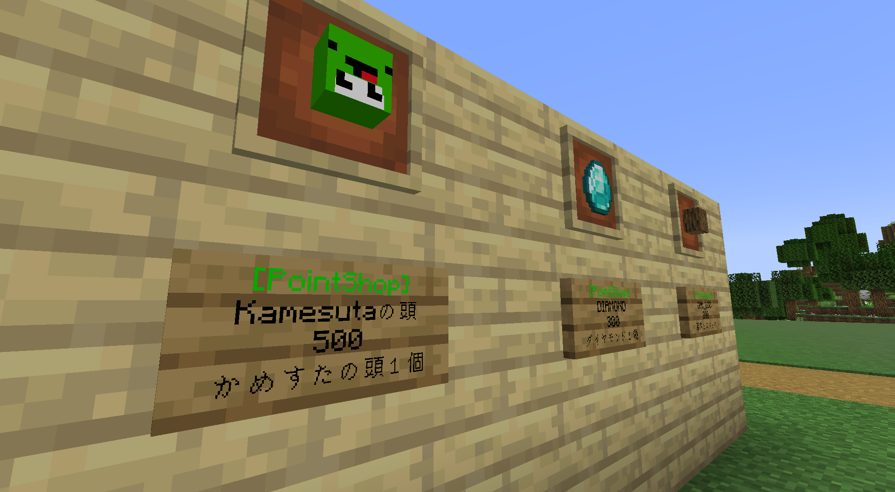
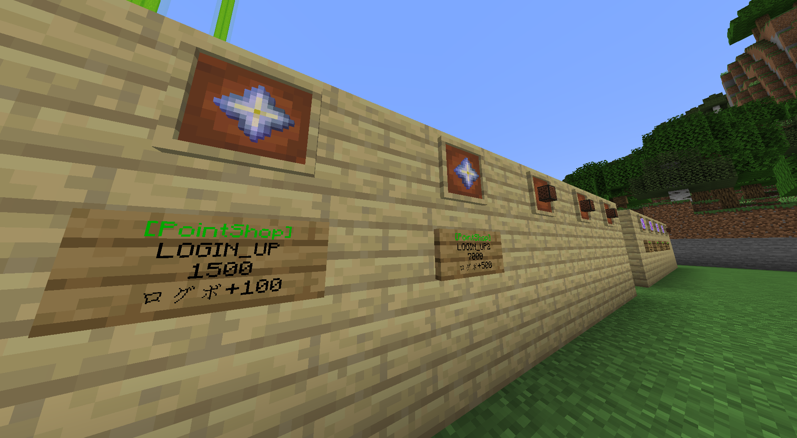
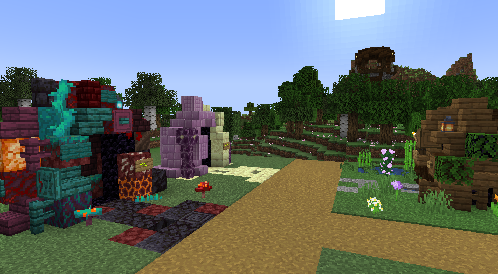
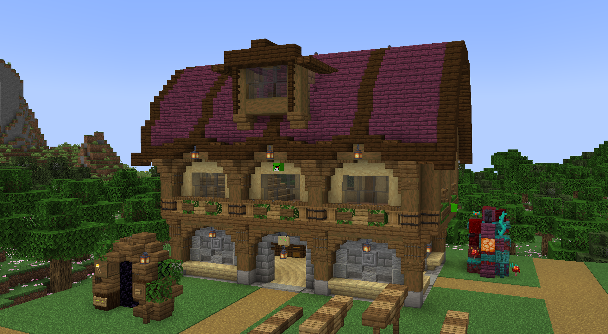
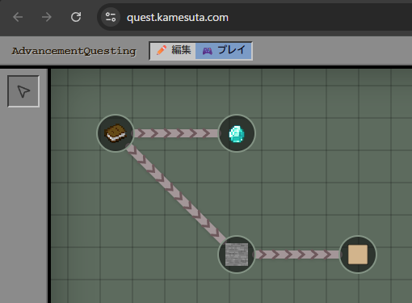
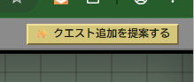

# 2026 ポイ活生活鯖

> 遊んで貯める、ポイ活スローライフ。様々なことをして得られるポイントを集めよう！

- **/ranking** で入手した総ポイント数のランキングと、自分のポイント数を確認できる
- ポイントは、様々なアイテムやエフェクト効果などと交換できる
- 死亡するとポイントを失う
- 集めたポイントを賭けてギャンブルをし、一発当てることもできる！

※アイテム価格は予期せず変更することがあります。

## ポイントを集めよう

生活鯖で遊ぶほどポイントが貯まり、便利なアイテムや楽しい効果と交換できる。

| ポイントをアイテムと交換 | ランキングで現在地を確認 |
| --- | --- |
|  |  |

### ポイントの入手方法

- ログインボーナス
- 進捗のクリア
  - オリジナル進捗も追加予定
- 1週間イベントでの勝利
- 定期的に行われる対象イベント
- クエスト
- 公共事業
- タスク
- ギャンブルで勝つ！

## サーバー概要

| 項目 | 内容 |
| --- | --- |
| バージョン | 1.21.11 |
| 難易度 | ハード |
| Keep Inventory | なし |
| PVP | オフ |
| 主催 | れい |

### 資源ワールド

- オーバーワールド、ネザー、エンドを用意
- 定期的にリセット
- 初期スポーン周辺のゲートから移動できる

### 共同倉庫

- 誰でも自由に利用できる
- みんなが使えるよう、きれいに使う
- 資源の独占は禁止

### ワールドガード

- メインワールドにはワールドボーダーを設定
- 初期範囲は **1000×1000**
  - 発展度合いによって広げる場合あり
- 冒険や資源採集は資源ワールドで行う

| ワールド内の施設 | 資源ワールドへのゲート |
| --- | --- |
|  |  |

## プラグイン一覧

### 🪙 ポイ活プラグイン

- ポイントを管理するためのプラグイン
- **/ranking** で総ポイント数のランキングと自分のポイント数を確認できる

### 🏆 実績プラグイン

- **Lキー** を押すと実績画面が開き、実績の取得順位を閲覧できる
- **/adv ＜閲覧したい人のMCID＞** を実行したあとLキーを押すと、ほかの人の実績を確認できる
  - もう一度Lキーを押すと自分の表示に戻る
- [実績ランキングの見方・詳細（Notion）](https://app.notion.com/p/3769951c9453808bb573dde0b5675454)

### 📜 クエストプラグイン

- **/quest** コマンドで表示されるURLからクエスト画面を開ける
- 達成条件を満たすと報酬がもらえる
- クエストは順次追加予定
- 右上の「クエスト追加を提案する」から、欲しいクエストを作成して提案できる
- 統合版は [quest.kamesuta.com](https://quest.kamesuta.com/) から開ける

| クエスト画面 | クエスト追加ボタン |
| --- | --- |
|  |  |

### 🚨 通報プラグイン

- 荒らしや迷惑行為を運営へ通報できる
- **/report ＜通報対象のMCID＞ ＜通報理由＞** で通報する

### 📍 タスクプラグイン

- ワールド各地の「タスク地点」を巡り、ミニゲームやお使いをこなす周回コンテンツ
- 村人や看板をクリックすると簡単なタスクを受けられる
- 常に「次に行くべき地点」が1つ案内され、報告すると次の地点へ進む
- 暇つぶしや、さっとポイントを稼ぎたいときにおすすめ

### 🎰 ギャンブルプラグイン

- 貯めたポイントを賭けて遊べる、自己責任の一発勝負
- 初期スポーン脇の賭博場で様々なギャンブルを遊べる
- コイン購入看板でコインを購入し、各台の看板をクリックしてスタート
- 稼いだコインは売却看板でポイントへ戻せる
- [ギャンブルの遊び方（Notion）](https://app.notion.com/p/3b09951c94538082b5c2c05999f3c44d)

## 処罰について

> **荒らしや窃盗は厳しく処罰します。** Discordと違い、警告などの措置は基本的になく、一発でBANになる場合があります。

- 荒らされた場合はロールバックを行う
- PVPはオフだが、溶岩を撒くなどして危害を加えた場合は処罰対象
- お互いに合意があっても、サーバーの雰囲気を悪くする行為（戦争など）は禁止
- Mobを大量に集めるトラップや装置は、サーバーへ負荷がかからない範囲にする
- プラグインのバグなどの悪用も処罰対象になる場合がある
- 治安維持などを理由に、運営から建築物の移動をお願いする場合がある
- [マイクラ鯖ルール](https://discord.com/channels/930083398691733565/1292059061319237713)を守る
- 運営の指示には従う

ルールやマナーを守って楽しく遊ぼう！

## Q&A

### Q. 何時から何時までワールドを開きますか？

**A. 一日中開きます。**

基本的に24時間開放。ただし、イベント中の21:00〜22:30は停止している。生活に支障をきたす人が出てきた場合は制限する可能性あり。

---

### Q. TNT Dupingはありますか？

**A. ありません。**

---

### Q. 放置は禁止ですか？

**A. 今のところ、特に規制はありません。**

---

サムネ画像制作：しぐ

[元のNotionページを見る](https://app.notion.com/p/3769951c9453807886ebca756e11838d)
