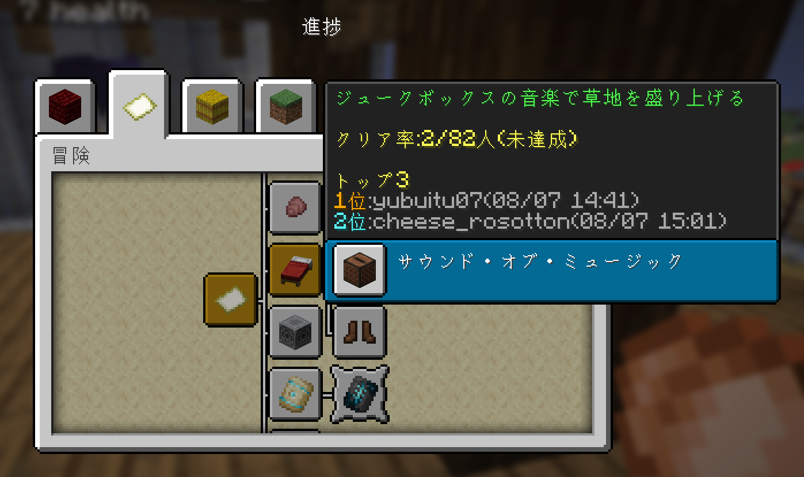
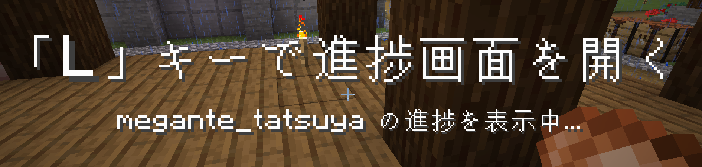
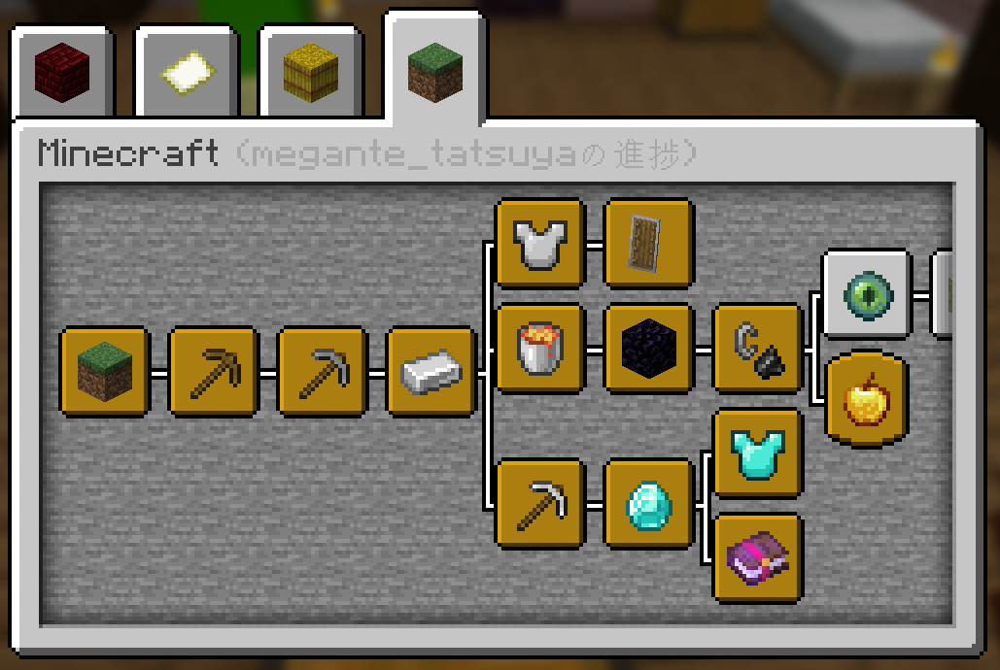
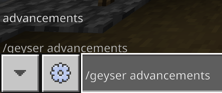
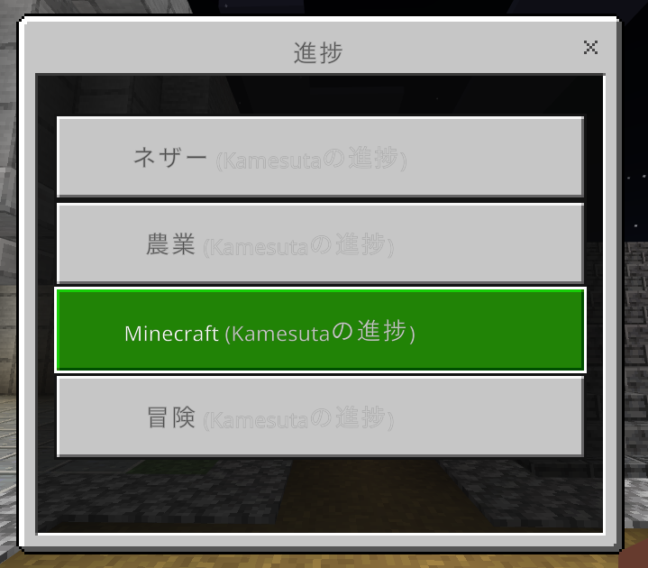
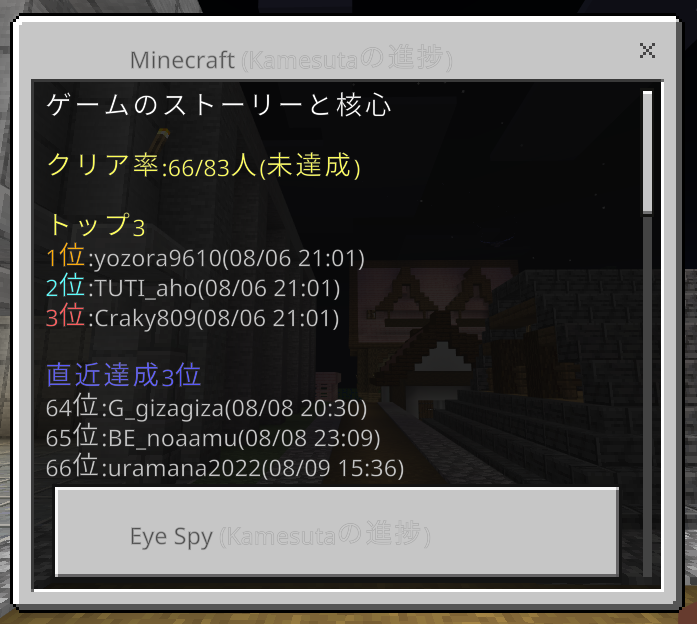
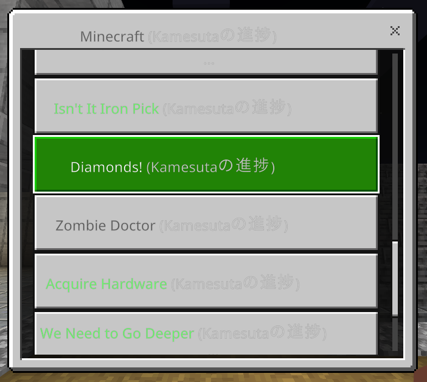

# 実績ランキングの見方・詳細

このサーバーでは実績ランキングプラグインが入っています。

「L」キーを押して実績画面を開くと、クリア率とランキング(早い順トップ3)が表示されます。

誰も取っていない実績をいち早く達成して、**ランキングに名を刻みましょう！**

> 統合版の方は「L」キーを押す代わりに [こちらの手順](/achievement-ranking) で確認できます

## 他プレイヤーの実績を見る

`/adv <プレイヤー名>` とコマンドを打ってから「L」キーで実績画面を開くと、他の人の実績を覗き見することができます。

## 統合版で実績を見る方法

統合版では「L」キーの代わりに `/geyser advancements` とコマンドを打つことで実績を確認することができます

