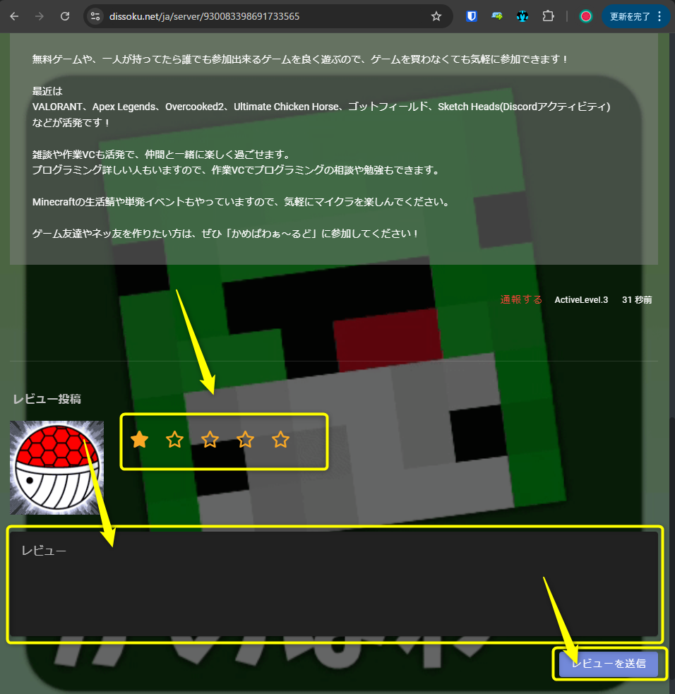
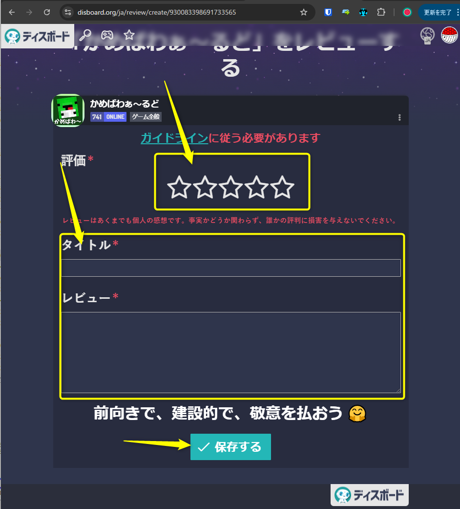

# disboard/ディス速の使い方

[**disboard/ディス速](https://discord.com/channels/930083398691733565/1131173695558258708)で、「/bump」「/dissoku up」というコマンドを打つだけです。**

「/bump」と打つと、[https://disboard.org/ja](https://disboard.org/ja)での表示順が、「/dissoku up」と打つと、[https://dissoku.net](https://dissoku.net)での表示順が上がり、サーバーに入ってきてくれる人が増えます。

サーバーの活性化の為にも、是非ご協力お願いします！

**また、サーバーの宣伝には、レビューも有効なようです。**

**是非レビューも書いていただけると助かります。**

**レビューの書き方 (ディス速)**

[https://dissoku.net/ja/server/930083398691733565](https://dissoku.net/ja/server/930083398691733565) の下のほうに書けるところあります。

**レビューの書き方 (Disboard)**

[https://disboard.org/ja/review/create/930083398691733565](https://disboard.org/ja/review/create/930083398691733565)

