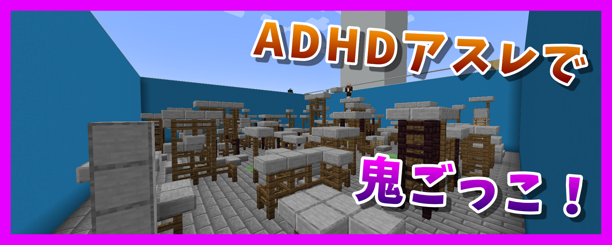
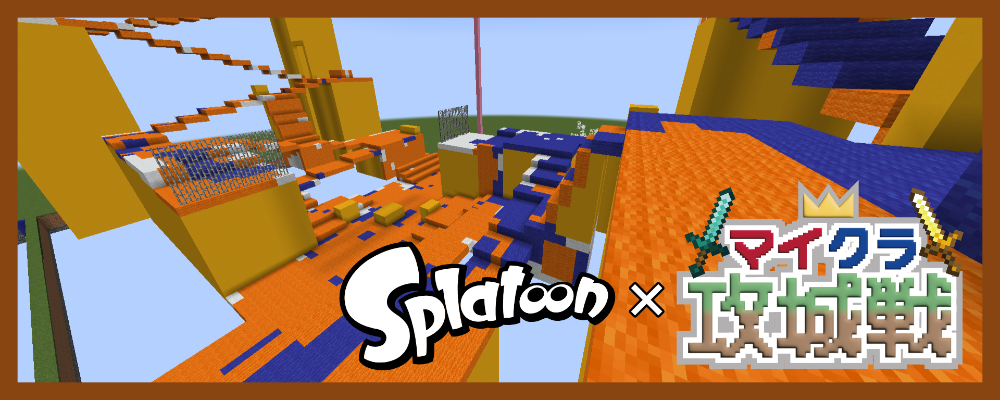
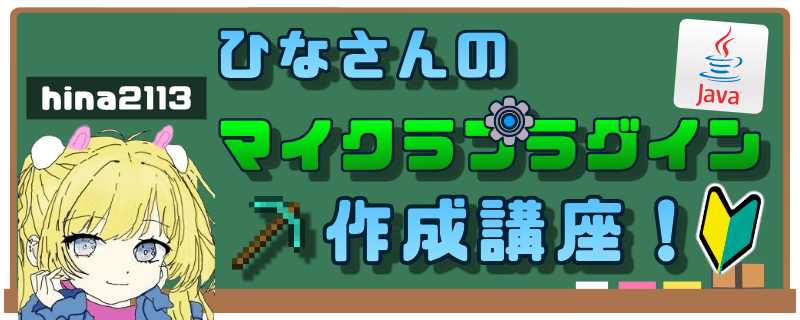

# イベントについて

## どんなことをしてる？

主に21:00~1時間程度、マイクラ企画や色々なゲームを一緒に遊んでいます～！

新規な人もぜひぜひいらっしゃーい！

## イベントについて知りたい

- [イベント予定](https://canary.discord.com/channels/930083398691733565/1246103208154103888) ：1週間分の予定をチェック！ 気になるイベントがあったら「興味ある」を押せば通知が来るよ！
- [イベント](https://canary.discord.com/channels/930083398691733565/1191248557483757628) ：イベント通知メンションが届きます！毎日のイベント参加者もここに記録されます
- [イベント案](https://canary.discord.com/channels/930083398691733565/1320021808220737649) ：なにかやりたいゲームや企画があればここに書いてみて～ (採用されるかも？)

## どんなゲームをしてる？

**企画例**

- マイクラPvP（攻城戦・PvP）
- 単発サバイバル／ミニゲーム
- 雑談系（技術講座・カラオケ）
- Webゲーム（bonk・お絵描き）
- Steam／任天堂ゲーム など

