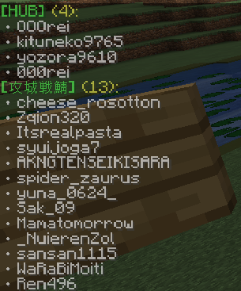
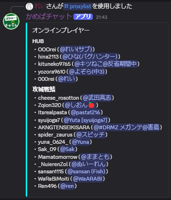

# 「マイクラ鯖とdiscordの連携」認証プラグイン の使い方

### マイクラ鯖とdiscordを繋ぐbotです

---

### マイクラアカウントとdiscordアカウントの連携を確認する方法

**`/proxylink <Type> <Key>`**

**マイクラのコマンド、discordのコマンドのどちらでも使用可能です**

- `<type>` → 検索タイプ
    - mc_uuid (MinecraftUUID)
        - マイクラのUUIDが分かっている場合に、そのアカウントと紐づいているdiscordアカウントを検索します
    - mc_name (MinecraftName)
        - MCIDが分かっている場合に、そのアカウントと紐づいているdiscordアカウントを検索します
    - dc_id (DiscordID)
        - discordのIDが分かっている場合に、そのアカウントと紐づいているMinecraftアカウントを検索します
    - dc_name (DiscordName)
        - discordの名前が分かっている場合に、そのアカウントと紐づいているMinecraftアカウントを検索します
- `<key>` → ID
    - `<type>` で指定したIDを入れます

### マイクラサーバーにログインしている人を確認する方法

`/proxylist`

**マイクラのコマンド、discordのコマンドどちらでも使用可能です**

- どのサーバーに誰がいるのかまで表示されます
- discordで使用すると、どのdiscordアカウントと紐づいているかも表示されます
- **コマンドを打たなくても、[https://discord.com/channels/930083398691733565/1403816019683971123](https://discord.com/channels/930083398691733565/1403816019683971123)から確認することができるようになりました**

### 指定した日時にマイクラサーバーに接続していたプレイヤーを確認する方法

`connect-server <server> <start> [end] [mode]`    

**discordのコマンドで使用可能です**

- `<server>` → 検索対象のサーバー
- `<start>` → 検索開始時刻
- `<end>` → 検索終了時刻
    - 未指定の場合は現在時刻
- `<mode>` → 出力方式
    - 全て
    - MCIDのみ
    - DiscordIDのみ

注意点

- `<start>` から `<end>` までの時間内にログインをしたプレイヤーが出力対象であり、`<start>` 以前からログインしていたプレイヤーは表示されません
    
    例：`<start>21:00`、`<end>22:00` で指定した場合、
    
    - 21:10~22:00 にログインしていたプレイヤーは出力されます
    - 20:30~22:00 にログインしていたプレイヤーは出力されません
