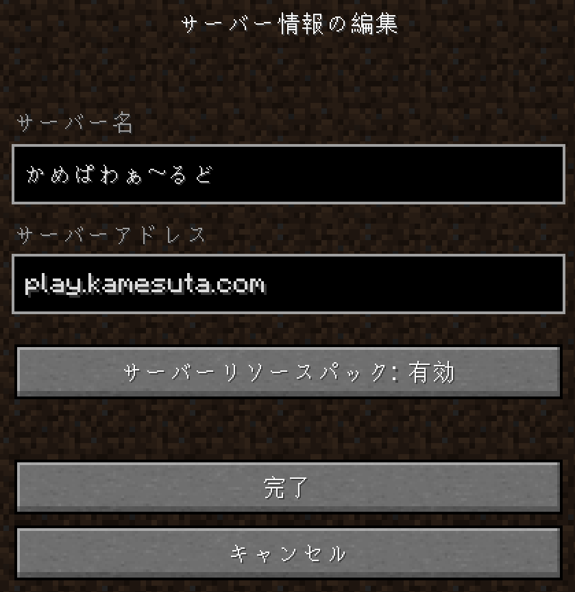
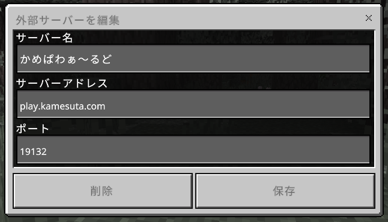
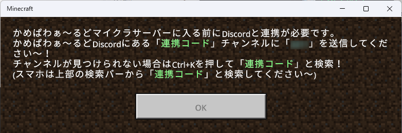
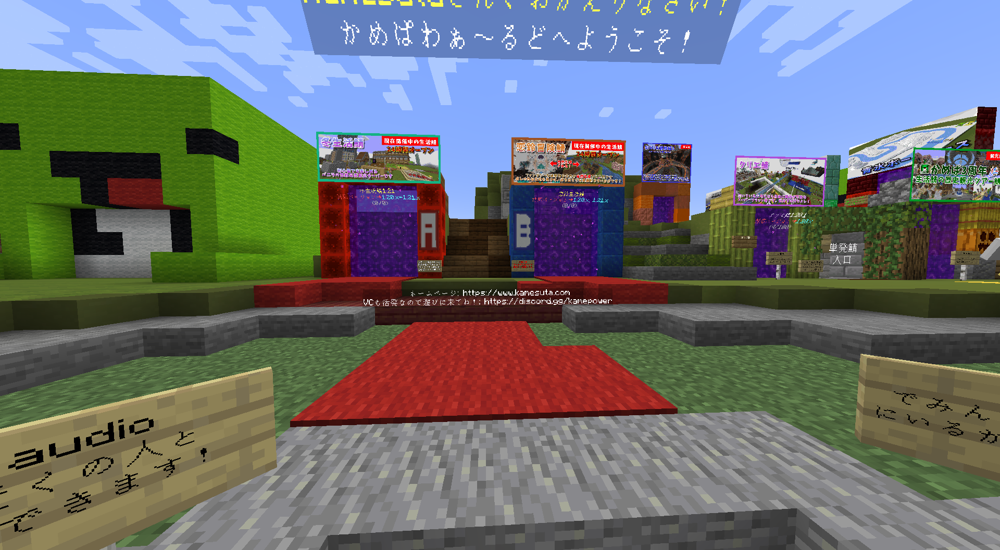

# マイクラ鯖への入り方

---

## ステップ１. マイクラサーバーに接続する

### Java版

`マルチプレイ`を押し、`サーバーを追加` から`サーバーアドレス`を入力！
サーバーアドレス: `play.kamesuta.com` 

### 統合版

`プレイ`を押し、`サーバー` から `サーバーを追加` を押して入力！
サーバーアドレス: `play.kamesuta.com`
ポート(そのまま): `19132`

---

## ステップ２. Discordと連携する

連携コードが表示されるので、[**マイクラ連携(Discord)**](https://discord.com/channels/930083398691733565/1004005131316113408) にコードを入力！

---

## ステップ３. もう一回入る

もう一回サーバーに接続すれば入れます！
HUB鯖に入れば、目の前には生活鯖

そして、右手にはクリエ鯖、奥には常時ともだちと遊ぶことができるミニゲーム鯖があるので、いろんなサーバーに入ってみましょう～。
(鯖は人がいないときは休眠しているので、ゲートくぐってから鯖に入るまで20秒くらいかかります)
「単発」コーナーはVCにいる人(常連ロールがついている人など)に聞いてみましょう。

[常時サーバーについて](/always-on-servers)

[単発サーバーについて](/one-off-servers)

