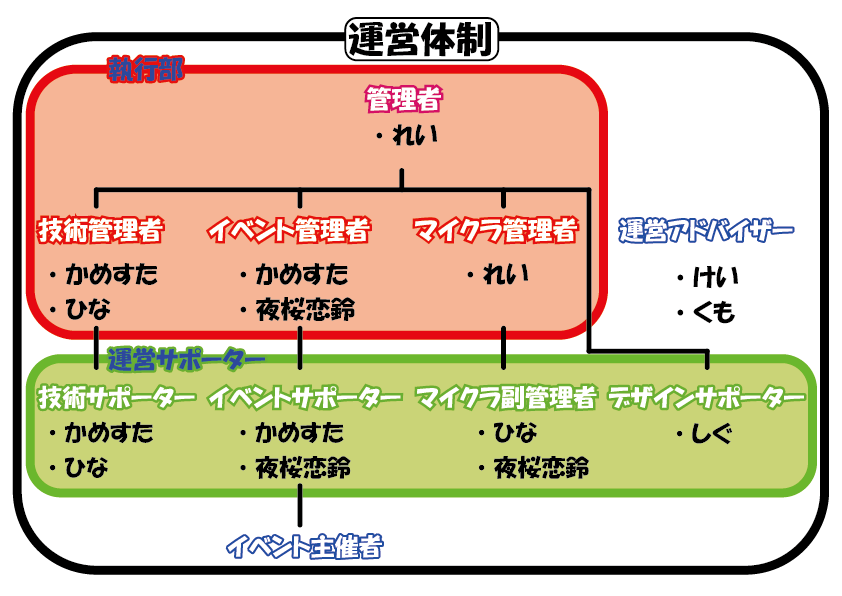

# 運営体制

役職メンバー一覧はこちらです→[**運営関連**](https://discord.com/channels/930083398691733565/1235457374463197315)

かめぱわ～るどの運営は、以下の役職によって成り立っています。

- **執行部**
    
    discordに荒らしが来た時などに、サーバーの治安を守ります。
    
    荒らしを、タイムアウト（一時的に行動できないようにする）したり、不適切なチャットを消したりします。
    
    - **管理者**
        - かめぱわ～るどの全体的な管理を行います。
        - 全体的な決定権や他の執行部の選定権などがあります。
        - チケットやお問い合わせの対応、違反者の対応などを行います。
    - **技術管理者**
        - サーバーのbotの管理・作成や、マイクラサーバーの技術的な管理などを行います。
        - 技術サポーターの選定権を持ちます。
    - **イベント管理者**
        - イベント予定の作成や、イベント主催者の選定など、イベントの管理を行います。
        - イベントスタッフやイベント主催の選定権を持ちます。
    - **マイクラ管理者**
        - 違反者のマイクラサーバーからのBANや、マイクラ副管理者の選定などを行います。
        - HUB鯖の管理などを行います
- **運営サポーター**
    - **技術サポーター**
        - 主に、技術管理者の補佐を行います。
    - **イベントスタッフ**
        - イベントの主催など、イベントに関する業務を行います。
    - **マイクラ副管理者**
        - マイクラサーバーに荒らしが来た時に、サーバーの治安を守ります。
        - マイクラサーバーでの荒らしを、tempBAN（マイクラ版タイムアウト）することができます。
        - その他、マイクラ管理者の補佐を行います
    - **デザインサポーター**
        - イベントのサムネイルや、絵文字・スタンプの作成などを行います。→[絵文字・スタンプについて](/emoji-and-stamps)
        - 絵文字・スタンプ案の選定などを行います。
- **イベント主催**
    - 主にイベントの主催を行います。
    - 執行部や運営サポーターといった運営メンバーとは別枠です
- **運営アドバイザー**
    - 運営メンバー経験者、かめぱをよく知る者として運営のアドバイスをする
    - 有事の際は運営のサポートを行う
